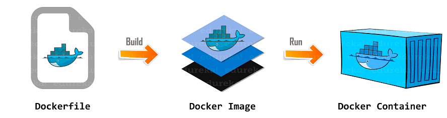

# Introduction

Prior to delving into databases, it's important that we acquaint ourselves with the fundamentals of [Docker](https://docs.docker.com/) and [Docker Compose](https://docs.docker.com/compose/). At this stage, we won't delve too deeply into it. Our main focus is to grasp the basic principles.

## Docker

Think of Docker as a suitcase. Just as a suitcase allows you to pack your clothes and essentials for any journey, Docker lets you package your application and all its dependencies for easy transportation. This 'suitcase' ensures your application works seamlessly, no matter where it is deployed - your computer, a colleague's machine, or a server in the cloud.

At the heart of Docker is the principle of **containerization**. Docker enables developers to package an application with all its dependencies into a standardized unit called a **Docker container**. This container ensures the application behaves the same way, irrespective of where it's deployed, thereby resolving environment inconsistencies.

A **Docker Image** is the skeleton of this container. It's a lightweight, standalone, executable package containing everything needed to run an application - the code, runtime, libraries, and environment variables. Docker creates these images using a **Dockerfile**, a file containing all the commands to assemble the Docker Image. Essentially, a Dockerfile serves as a set of instructions for Docker to build an image.

# <div class="text--center"> </div>

## Docker Compose

As your application becomes more complex with multiple components that need to interact, managing these becomes more challenging. That's where Docker Compose comes in, acting like an organizer. It lets you outline the interactions of each component of your application and handle them all together in a simpler, more coordinated way.

Together, Docker and Docker Compose make managing and deploying complex applications easier, smoother and more reliable.

## Docker licensing model

Docker has several key components that allow it to build, transport, and manage containers efficiently. Here are the fundamental parts:
- **Docker Engine**: The heart of Docker, it's a lightweight runtime and tooling that builds and manages containers.
- **Docker CLI** (Command Line Interface): A tool that allows users to interact with Docker directly using commands. This is where user inputs commands to interact with the Docker daemon.
- **Docker Desktop** (UI): An application that is designed to facilitate the developer's workflow by providing an intuitive user interface to interact with Docker.

:::tip NOTE
On August 31 2021 Docker Inc. announced a [change in the licensing model](https://www.docker.com/blog/updating-product-subscriptions/) for Docker Desktop. As of January 31 2022, Docker Desktop is no longer free and users need to pay a monthly subscription fee of $5 per month. Docker Desktop remains free for small businesses (fewer than 250 employees AND less than $10 million in annual revenue), personal use, education, and non-commercial open-source projects.
:::

## Podman & Podman Compose

Taking into account the Docker Desktop licensing model, we will use [Podman](https://podman.io/) in Node.js program. It is an open-source, free to use tool that is designed to be a drop-in replacement for Docker. Podman supports Dockerfile syntax, can pull and run Docker images. Podman can be used instead of Docker without having to modify existing Dockerfiles or images.

Podman is compatible with the most common operating systems, including MacOS, Windows, Linux. Please follow instructions [here](https://podman.io/docs/installation) to install Podman on your local machines.

[podman-compose](https://github.com/containers/podman-compose) is a command-line tool for defining and running multi-container Docker applications with Podman. It is similar to Docker Compose, but instead of requiring Docker, it uses Podman container engine to build and run the containers. Please follow instructions [here](https://github.com/containers/podman-compose#installation) to install podman-compose on your local machines.

We will use Podman CLI in the program, but if you want a graphical tool that allows you to seamlessly work with containers from your local environment, please check [Podman Desktop](https://podman-desktop.io/downloads), an analogue of Docker Desktop.

:::danger Note
Please be aware that the book will continue to make references to Docker and Docker Compose in subsequent modules. They are widely recognized and established tools in the industry. Most probably during interviews you will be asked about Docker, but not about Podman. The essential point to comprehend here is that Podman serves as a complimentary alternative to Docker (as does Podman Compose). Thus, anything you can execute with Docker can also be accomplished using Podman. **We strongly recommend you to use Podman and Podman Compose**.
:::

## Examples

### Build and run a simple Dockerfile using Podman


1. Create a new directory to host your project:

   `$ mkdir myproject && cd myproject`

2. Create a new file called `Dockerfile` and add the following content:

   ```
   FROM alpine:latest
   CMD ["echo", "Hello, World!"]
   ```

   This Dockerfile uses Alpine Linux as the base image and sets the command to print "Hello, World!" when the container runs.

3. Build the Docker image using Podman:

   `$ podman build -t my-image .`

   This command builds the Docker image using the `Dockerfile` in the current directory (`.`), and tags it with the name `my-image`.

4. Run the Docker container using Podman:

   `$ podman run -it my-image`

   This command runs the Docker container using the `my-image` image we just built, and opens an interactive terminal session (`-it`).

5. Verify that the container printed "Hello, World!" to the terminal. You should see output similar to this:

   ```
   Hello, World!
   ```

That's it! You have successfully built and run a Docker container using Podman. This is just a simple example, but you can use Podman to build and run more complex Dockerfiles easily.

### Run simple docker-compose file using Podman


1. Create a new directory for your project and navigate to it:

   ```
   $ mkdir myproject && cd myproject
   ```

2. Create a new file called `docker-compose.yml` and add the following content:

   ```
   version: '3'
   services:
     nginx:
       image: nginx:latest
       container_name: my-nginx
       ports:
         - 8080:80
   ```

   This docker-compose file instructs Podman to create a container running the latest version of the `nginx` image, specifies the container name as `my-nginx`, and binds port 80 inside the container to port 8080 on the host machine.

3. Start the container using podman-compose:

   ```
   $ podman-compose up -d
   ```

   This command starts the container using podman-compose, with the `-d` option running the containers in the background.

4. Verify that the container is running:

   ```
   $ podman ps
   ```

   This command should display a list of running containers, including `my-nginx`.

5. Test the container:

   Open a web browser and navigate to `http://localhost:8080`. You should see the default Nginx homepage.

   Alternatively, run the following command to test the container from the command line:

   ```
   $ curl http://localhost:8080
   ```

   You should see output similar to this:

   ```
   <!DOCTYPE html>
   <html>
   <head>
   <title>Welcome to nginx!</title>
   ...

That's it! You have successfully run a docker-compose file using Podman. You can use podman-compose to run more complex docker-compose files easily.

## Cheat sheet

### Docker to Podman commands

Num | Description | Docker | Podman |
--- | --- | --- | --- |
1 | Build container | docker build -t my-node-app . | podman build -t my-node-app . |
2 | Run container | docker run -p 3000:3000 my-node-app | podman run -p 3000:3000 my-node-app |
3 | Get list of containers running | docker ps | podman ps |
4 | Stop container | docker stop {container_id} | podman stop {container_id} |
5 | Tag image | docker tag myimage:v1 myregistry.com/myimage:v1 | podman tag myimage:v1 myregistry.com/myimage:v1 |
6 | Push image  | docker push myregistry.com/myimage:v1 | podman push myregistry.com/myimage:v1 |
7 | Pull image | docker pull myregistry.com/myimage:v1 | podman pull myimage:v1 myregistry.com/myimage:v1 |

You can see all the commands available by running `podman --help`.

### Docker Compose to Podman Compose commands

Num | Description | docker-compose | podman-compose |
--- | --- | --- | --- |
1 | Create and start containers | docker-compose up -d | podman-compose up -d |
2 | Get list of containers running | docker-compose ps | podman-compose ps |
3 | Stop and remove containers, networks | docker-compose down | podman-compose down |

You can see all the commands available by running `podman-compose --help`.


