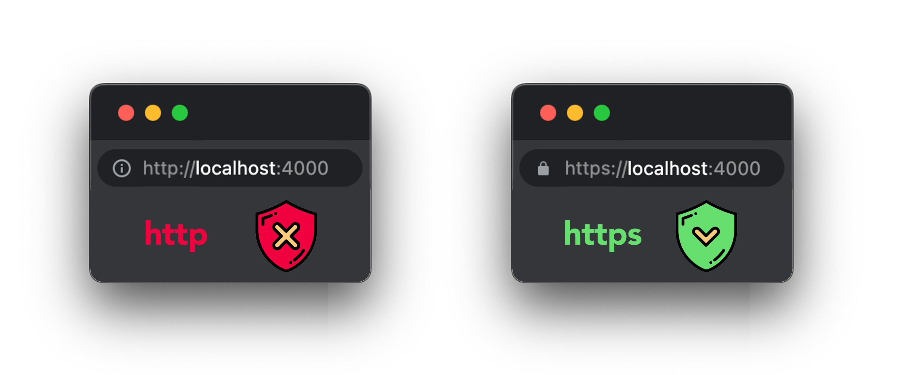
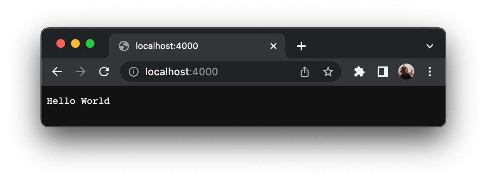
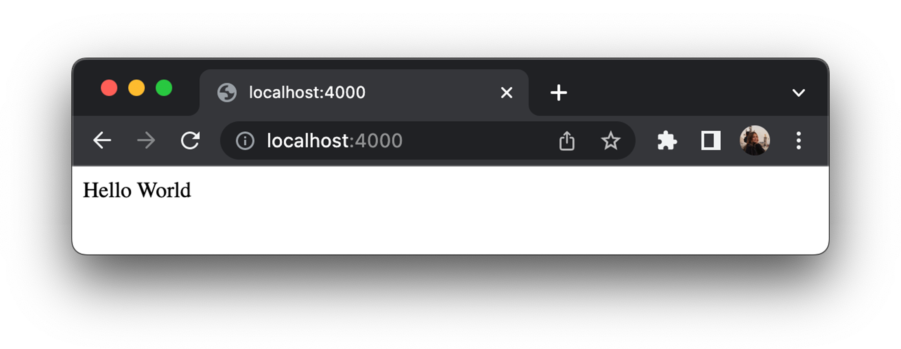

# HTTP(S)

Node.js has a built-in module called [HTTP](https://nodejs.org/api/http.html)/[HTTPS](https://nodejs.org/api/https.html), which allows Node.js to transfer data over the Hyper Text Transfer Protocol (HTTP).

HTTPS is HTTP with encryption. The difference between the two protocols is that HTTPS uses TLS (SSL) to encrypt normal HTTP requests and responses. As a result, HTTPS is far more secure than HTTP.



To include the HTTP module, use the `require()` method:

```js
const http = require('http');
```

or

```js
const https = require('https');
```

## Running HTTP Web Server

The HTTP module can create an HTTP server that listens to server ports and gives a response back to the client.

Use the `createServer()` method to create an HTTP server:

```js title="app.js"
const http = require('http');

const port = 4000;

const server = http.createServer((req, res) => {
  res.end('Hello World');
});

server.listen(port, () => {
  console.log(`Server running 🚀 at http://localhost:${port}/`);
});
```

The function passed into the http.createServer() method, will be executed when someone tries to access the computer on port 4000.

Save the code above in a file called "app.js", and initiate the file:

```bash
node app.js
# Server running 🚀 at http://localhost:4000/
```

If you have followed the same steps on your computer, you will see the same result as the example: [http://localhost:8080](http://localhost:8080)



### Add an HTTP Header

If the response from the HTTP server is supposed to be displayed as HTML, you should include an HTTP header with the correct content type:

```js title="app.js"
const http = require('http');

const port = 4000;

const server = http.createServer((req, res) => {
  // highlight-next-line
  res.setHeader('Content-Type', 'text/html');
  res.end('Hello World');
});

server.listen(port, () => {
  console.log(`Server running 🚀 at http://localhost:${port}/`);
});
```



### Working with the Query String

The function passed into the http.createServer() has a `req` argument that represents the request from the client. This object has a property called `url` (read more about this module [here](https://www.w3schools.com/nodejs/nodejs_url.asp)) which holds the part of the url that comes after the domain name. 

Besides, there are built-in modules to easily split the query string into readable parts, such as the URL module. Let's see an example below:

```js title="app.js"
const http = require('http');
// highlight-next-line
const url = require('url');

const port = 4000;

const server = http.createServer((req, res) => {
  res.setHeader('Content-Type', 'text/html');

  // highlight-start
  const { query } = url.parse(req.url, true);
  const date = query.year + " " + query.month;

  res.end(date);
  // highlight-end
});

server.listen(port, () => {
  console.log(`Server running 🚀 at http://localhost:${port}/`);
});
```

Save the code above in a file called "app.js", run it and go to [http://localhost:8080/?year=2017&month=July](http://localhost:8080/?year=2017&month=July)


## HTTPS

To built an [HTTPS](https://nodejs.org/api/https.html#https) server with Node.Js, we need an [SSL](https://www.cloudflare.com/learning/ssl/what-is-an-ssl-certificate/) (Secure Sockets Layer) certificate. 

Speaking generally, there are two kinds of certificates: those signed by a 'Certificate Authority', or CA, and 'self-signed certificates'. A Certificate Authority is a trusted source for an SSL certificate, and using a certificate from a CA allows your users to trust the identity of your website. In most cases, you would want to use a CA-signed certificate in a production environment - for testing purposes, however, a self-signed certificate will do just fine.

### A self-signed SSL certificate

We can create a self-signed SSL certificate on our local machine. By running the following commands there will be created `key.pem` and `cert.pem`:

```bash
openssl genrsa -out key.pem
openssl req -new -key key.pem -out csr.pem
openssl x509 -req -days 9999 -in csr.pem -signkey key.pem -out cert.pem
rm csr.pem
```

### A CA-signed SSL certificate

Alternatively, we can create SSL signed by a 'Certificate Authority', or CA (the example below is written for MacOS):

- Firstly, install [mkcert](https://github.com/FiloSottile/mkcert) with:
```bash
brew install mkcert
```
- Add the `mkcert` tool to the list of local root CAs.
```bash
mkcert -install
```
- Create a mkcert-signed certificate for your site. By running:
```bash
mkcert localhost
```
It will create 2 files: `localhost-key.pem` and `localhost.pem`.

### Running HTTPS Web Server

Make sure that both `key.pem` and `cert.pem` are located in the same root as `app.js` file.

Try it out by copying the code snippet below:

```js title="app.js"
// highlight-next-line
const https = require('https');
const fs = require('fs');

// highlight-start
const options = {
  key: fs.readFileSync('key.pem'),
  cert: fs.readFileSync('cert.pem')
};
// highlight-end

const port = 4000;

// highlight-next-line
const server = https.createServer(options, (req, res) => {
  res.writeHead(200);
  res.end("Hello world");
});

server.listen(port, () => {
  console.log(`Server running 🚀 at https://localhost:${port}/`);
});
```

Now that your server is set up and started, you should be able to check it out by going to [https://localhost:4000/](https://localhost:4000/).

## Making HTTPS Request

The following code will send a GET request to [NASA’s API](https://github.com/nasa/apod-api) and print out the URL for the astronomy picture of the day as well as an explanation:

```js title="app.js"
const https = require('https');

https.get('https://api.nasa.gov/planetary/apod?api_key=DEMO_KEY', (response) => {
  let data = '';

  // A chunk of data has been received.
  response.on('data', (chunk) => {
    data += chunk;
  });

  // The whole response has been received. Print out the result.
  response.on('end', () => {
    console.log(JSON.parse(data).explanation);
  });

}).on('error', (error) => {
  console.log("Error: " + error.message);
});
```

Much of the HTTP/HTTPS, module’s functionality is fairly low-level. You’re required to receive response data in chunks rather than just providing a callback function to be executed as soon as all of the data is received. You also need to parse the response data manually. This is fairly trivial if it is JSON formatted, but it is still an extra step.
