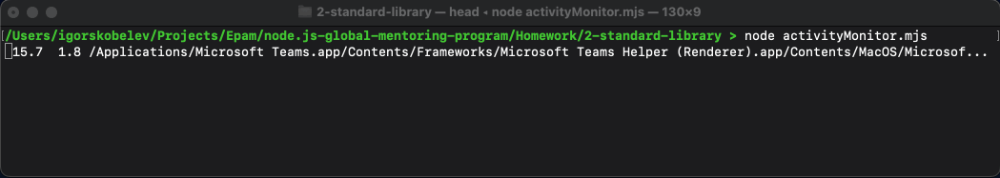

import { TableForMentors } from '../../src/components/TableForMentors';

Let's write our simplified version of the `top` CLI utility program. It provides a dynamic real-time view of the running system. Usually, this command shows the summary information of the system and the list of processes or threads currently managed by the *nix kernel. Our goal is to show the most CPU-intensive process that's running on the system.

## Acceptance criteria
1. Program uses system shell command output (see Hints) to retrieve process name, CPU, and memory usage details.
2. Refresh rate is ten times per second.
3. The program uses only the standard library; any third-party modules are prohibited.
4. Each update will *NOT* start from the new line. It is always displayed only in one row.
5. Once per minute program appends the output to the log file `activityMonitor.log` in the format `<unixtime> : <process info>`. If the file doesn't exist - the program creates it.
6. Program supports `Linux`, `macOS`, and `Windows` operating systems.

## Evaluation criteria

<TableForMentors data={[
  {
    items: [
      {
        text: "Only standard library is used",
        points: 2,
      },
      {
        text: "System command is used to retrieve process name, CPU, and memory usage (from Hints)",
        points: 1,
      },
      {
        text: "Refresh rate is ten times per second",
        points: 2,
      },
      {
        text: "Command output is written to activityMonitor.log file in the proper format",
        points: 1,
      },
      {
        text: "Command output is written to activityMonitor.log file every 1 minute",
        points: 2,
      },
      {
        text: "Program supports Linux, macOS, and Windows operating systems.",
        points: 2,
      }
    ]
  },
]}/>

## Hints
System commands to retrieve the process:
- **Unix-like OS** `ps -A -o %cpu,%mem,comm | sort -nr | head -n 1`
- **Windows** `powershell "Get-Process | Sort-Object CPU -Descending | Select-Object -Property Name, CPU, WorkingSet -First 1 | ForEach-Object { $_.Name + ' ' + $_.CPU + ' ' + $_.WorkingSet }"`
- Carriage return escape sequence is `\r`
