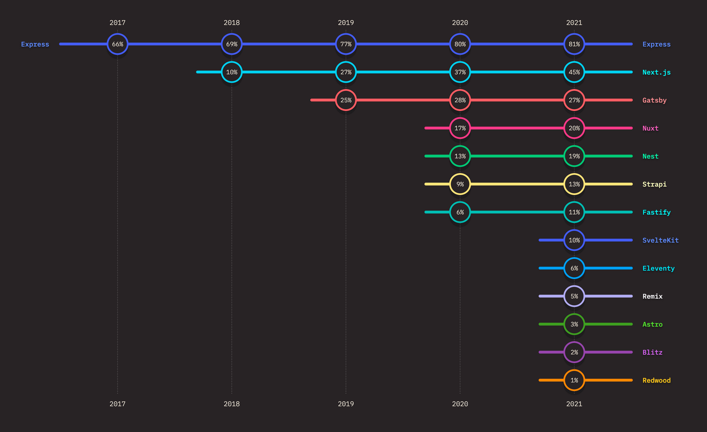
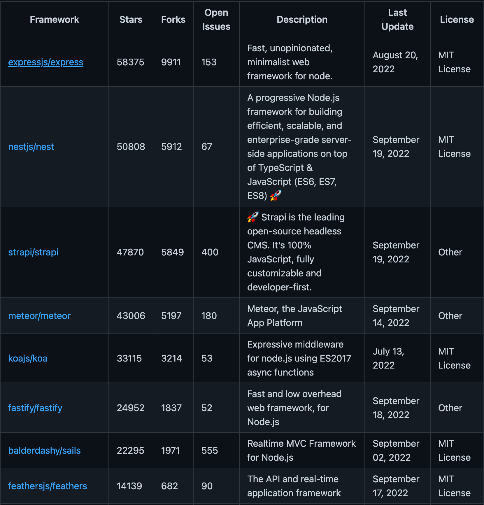

# Which frameworks to choose?
Express is not the only framework that we have in Node.js world. There are a lot of them: [Koa.js](https://koajs.com/), [Nest.js](https://nestjs.com/), [Loopback](https://loopback.io/), [Sails.js](https://sailsjs.com/), [Hapi.js](https://hapi.dev/), [Fastify](https://www.fastify.io/), etc.

Below you can see the usage of Node.js frameworks according to [The State of JS](https://2021.stateofjs.com/en-US/):

As you can see, express is still the most popular Node.js framework, despite it being one of the oldest. If we exclude frameworks that are intended for creating server-side rendering servers or any other backend frameworks for fronted (such as Next.js and Gatsby for React, Nuxt for Vue), we will see that Nest.js is the next in the list.

There is a GitHub [repository](https://github.com/VanoDevium/node-framework-stars) that collects information about GitHub’s stars of Node.js frameworks. And Express is number one on this list as well. In the screenshot below you can find the Top 8 Node.js frameworks, the full list is available in the [repository](https://github.com/VanoDevium/node-framework-stars).

You might notice that Nest.js is catching up with Express by the number of stars on GitHub as well. This framework is quite popular today and more and more developers decide to use Nest.js as the main framework for their applications in Epam. The thing is, Nest.js is based on express by default, and having an understanding of Express will help you with learning Nest.js.

### So which framework to choose?

There is no simple answer. You need to consider the size of your application, team level, customer constraints, etc. Here just a few statements that might help you to choose:

- Express is the most popular framework
- Express is not actively supported and has lack of modern features 
- Nest.js has a lot of things out of the box that you might use
- Nest.js is a complex framework, and it's needed time to learn it
- Koa is developed by the Express team
- Fastify provides better performance
- ...

Today it is de facto standard to use Nest.js for medium and big applications because it has a predefined structure, some built-in modules, and good documentation. You still can choose Express or Koa for big and complex projects, but in that case, you will be needed to implement a lot of things, that are out-of-the-box in Nest.js.    
For small applications, it might be [overkill](https://dictionary.cambridge.org/dictionary/english/overkill) to use Nest.js because the biggest part of functionalities will not be used. 

### Framework free

There are some cases when you don't even need a framework. For example, you are writing a function to deploy it to AWS Lambda, or you need to write some script. But for most cases, it's better to not invent a wheel and get benefits from frameworks. 
