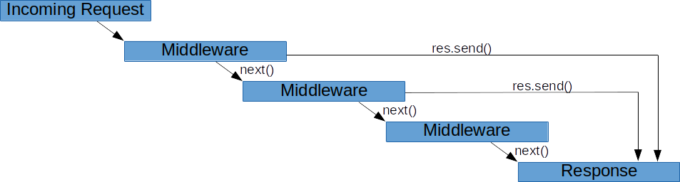

# Overview of Express
The code snippet below creates a simple [Express](https://expressjs.com/en/guide/using-middleware.html) server:

```jsx
const express = require('express');

const app = express();

app.listen(3000, () => {
    console.log('Server is started');
})
```

`app` is an instance of our server and will be used for adding routers, middlewares, and error handlers.

Expressjs provides us with **three major features:**

- routing
- middlewares
- error handling

In this module, we will explain all three parts.

### Routing

As you might notice from our previous example of using HTTP it doesn’t have any routing features. If you want to add a new endpoint you need manually check the HTTP method and URL of a request. Express provides quite a handy routing feature. For adding an endpoint you can just use `app.<method>(url, handler)`

- *method -* is any HTTP request method, you can add an endpoint for. Or `all` it for all methods.
- *url* - is a string that represents URL of your endpoint
- *handler* - is a callback that will be called when a request with provided *method* and URL was made

For example:

```jsx
app.get('/users/:userId', () => {});
app.put('/users/:userId/groups', () => {});
app.post('/comments', () => {});
app.get('/comments', () => {});
app.delete('/comments/:commentId', () => {});
```

You might notice column`:` symbol in the path, that’s route **param**. `/users/:userId` will match any route that starts with `/users/` and then has anything (except `/` , because it will be another route). It’s useful when we want to have the ability to send some id in the URL. In the handler you don’t need to parse the URL to get this param, the value will be accessible in `req.params.usersId` . It’s possible to have several such params in one endpoint, but they must be named differently. You can also use limited `regexp` functionality inside the path. More details are here.

In big applications can be a big amount of endpoints. For example, a lot of that might be started with `/users/`. Expressjs provides routers to separate such logic. We can improve our previous example by using routers:

```jsx
const app = express();
const usersRouter = express.Router();
const commentsRouter = express.Router();

usersRouter.get('/users/:userId', () => {});
usersRouter.put('/:userId/groups', () => {});
commentsRouter.post('/', () => {});
commentsRouter.get('/', () => {});
commentsRouter.delete('/:commentId', () => {});

app.use('/users', usersRouter);
app.use('/comments', commentsRouter);
```

In this example, two routers were created. After adding endpoint to routers, we added them to our app by using `app.use('/users', usersRouter)` and `app.use('/comments', commentsRouter)` . Those routers can be located in different modules and you are able to separate logic related to different entities (users and comments in our example).

### Middlewares

Middleware - is a function that has 3 arguments request, response, and next.
These functions might be used for some logic that should be executed for several or even all endpoints. For example, if you need to log information about every request you can add a logger invocation in every handler, but much better to implement it only once. Another use case is user authentication. You can create auth middleware that will reject all requests that don’t have correct tokens in their headers. Example of logger middleware:

```jsx
const logger = (req, res, next) => {
    console.log(`New request: ${req.method}, ${req.url}`);
    next();
}
```

To add middleware to all routes you can use `use` method of express instance:

```jsx
app.use(logger);
```

You can also specify paths when a middleware should be executed:

```jsx
app.use('/api', logger);
```

In the example above `logger` will be executed for all routes starting with `/api` . Even if the route has more slashes. It means that both `/api` and `/api/users/31` routes will be logged.

> It’s the main difference between `use` and `all` methods of Express. The first one is for middlewares and they will be executed for all routes that start with provided path, unlike `all` method that will work for the exact path that you provide and will ignore paths that have more slashes.
>

Middlewares also can be added to specific routes. To add middleware to some routes, you can just add it after the route path, and before the handler.  Actually, your handler it’s a middleware, but in most cases, we do not need the next function in our handlers, because it’s the last stop for our request and the response will be sent in it.

```jsx
app.get('/api/users/:userId', logger, (req, res) => {
    res.send();
})
```
Below you can take a look at visualization of how middlewares in Express work:



### Error handling

Express has its own error handling out of the box. If any of your middleware throws an exception, it will be caught by a built-in error handler and return an HTML string with a message and stack trace from an error object.

You can create error handler middleware that will be invocated only when there is an exception in middlewares (or handlers) that were declared before the error handler. To convert a middleware into an error handler middleware, you need just to add one more argument at the beginning of the arguments list - error. Express distinguishes regular middlewares from error handlers by the number of arguments that they have. For example:

```jsx
app.get('/api/users/:userId', () => {
    throw new Error('User was not found');
});

app.use((err, req, res, next) => {
    console.log(err);
    res.status(500);
    res.send({ message: err.message });
});
```

The error from the handler will be caught in the error handler. It’s still middleware and we have access to the request and the response and we are able to send a response back or any additional useful things.

Because an error handler it's a middleware, the order matters. If the error handler declared before middleware that throws an exception, this exception will not be caught by the error handler:

```jsx
app.use((err, req, res, next) => {
    console.log(err);
    res.status(500);
    res.send({ message: err.message });
});

app.get('/api/users/:userId', () => {
    throw new Error('User was not found'); // Will be caught by built-in error handler
});
```

It’s possible to have several error handlers that you can declare in the same way as regular middlewares:

```jsx
const errorHandler = (err, req, res, next) => {
    console.log(err);
    res.status(500);
    res.send({ message: err.message });
};

app.get('/api/users/:userId', handler, errorHandler);
app.use('/api', errorHandler);
app.use('/api', usersRouter, errorHandler);
```

> It’s important to specify the `next` argument in error handlers even if it’s not used. If the `next` is omitted, then the function will have only 3 arguments (err, req, res) and it will be considered as a regular middleware.
>

Moreover, you can declare an error handler after another error handler, to catch an error that was thrown in another error handler:


For example:

```jsx
app.use((err, req, res, next) => {
   throw new Error('Error from error handler');
});
app.use((err, req, res, next) => {
    console.log(err);
    res.status(500);
    res.send({ message: err.message });
});
```

The error from the first error handler will be caught in the second one. In most cases, it’s enough to have one error handler and this example just shows the mechanism of how it works, it’s not recommended to have a complex error-handling flow.
