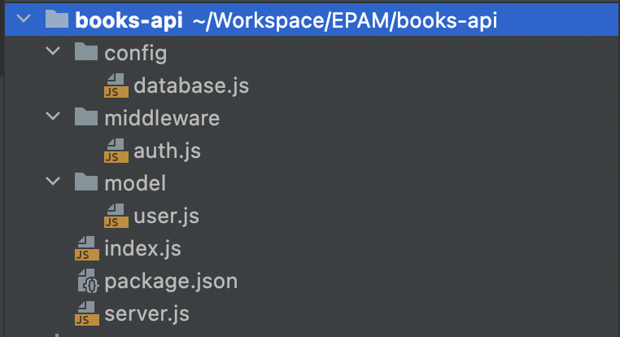

 
# Setup project
## Description
We will create rest api server that allow authors to upload books. This server will provide authentication and authorization to secure author data to be modified by unauthorized user.
## Create project folder
Let's create project folder and init npm
```shell
mkdir books-api

cd books-api

npm init -y
```
## Create basic structure

We will create basic project structure such as `model`, `middleware`, `config` directories:
```shell
mkdir model middleware config

touch config/database.js middleware/auth.js model/user.js
```

Now we can create `index.js` and `server.js` files in the root directory the project:
```shell
touch server.js index.js
```

After that you should see the following structure:



## Install dependencies
During this project we will use `mongoose`, `jsonwebtoken`, `express`, `dotenv`, `bcryptjs` dependencies. Let's install them: 

```shell
npm install mongoose express jsonwebtoken dotenv bcryptjs
```

We will also `nodemon` to serve our server for development:

```shell
npm install nodemon -D
```

## Connect DB
First we will run mongo db server using docker:

```shell
docker run -d -p 27017:27017 --name books-api-mongo mongo:latest
```
Now we can configure our db connector to communicate with mongo server that we've already started. For this we will modify `config/database.js` file:

```js
const mongoose = require("mongoose");

const { MONGO_URI } = process.env;

const connect = async () => {
    try {
        await mongoose.connect(MONGO_URI);
        console.log("Successfully connected to database");
    } catch (e) {
        console.log("DataBase connection failed. exiting now...");
        console.error(error);
        process.exit(1);
    }

}

module.exports = {
    connect
};
```

Now let's configure our `server.js` file:
```js
const dotenv = require("dotenv");
const database = require("./config/database");
const express = require("express");

const bootstrap = async () => {
    // use .env file to configure environment variables
    dotenv.config();
    // connect to database
    await database.connect();

    const app = express();

    app.use(express.json());

    return app;
}
```

In our `index.js` let's add logic to start server:
```js
const http = require("http");

require("./server").bootstrap().then(app => {
    const server = http.createServer(app);

    const { API_PORT } = process.env;
    const port = API_PORT || 8080;

    // server listening
    server.listen(port, () => {
        console.log(`Server running on port ${port}`);
    });
});
```
Now when base code finished we can configure our environment. Create `.env` file and add the following:

```shell
API_PORT=8080

MONGO_URI=mongodb://localhost:27017/books
```

After we configured environment variables, we can extend `package.js` with new scripts to simplify running of our server:

```json
...
"scripts": {
   "start": "node index.js",
   "dev": "nodemon index.js",
}
...
```

Now run `npm run dev` command. Our server is started and connected to the mongodb.

